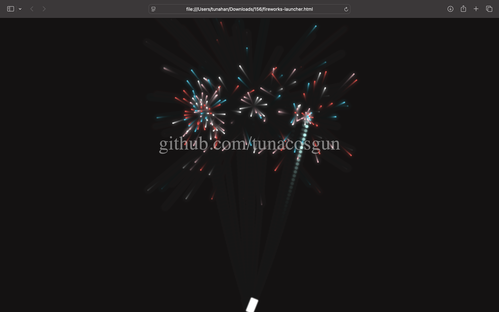

<h1 align="center">🎆 Fireworks Launcher</h1>

<p align="center">
  <em>Canvas üzerinde dinamik havai fişek simülasyonu — mouse/touch ile top at, parçacıklar patlasın!</em>
</p>

> **Description:** Canvas tabanlı, mouse/touch ile kontrol edilen havai fişek simülasyonu.  
> Saf **HTML + CSS + JavaScript** ile yazıldı; mobil ve masaüstü uyumlu, bağımlılık gerektirmez.

<p align="center">
  
</p>

---

## 🖼️ Demo

<p align="center">
  
</p>

> **Not:** `demo.gif` dosyasını bu README ile **aynı klasöre** koy. Dosya adında büyük/küçük harfe dikkat et (ör. `Demo.gif` ≠ `demo.gif`).

---

## ✨ Özellikler

- 🧨 **Gerçek zamanlı parçacık patlamaları** (Canvas 2D)
- 🖱️ **Mouse & Touch kontrolü** — hedefe nişan al, basılı tut, seri atış yap
- 🎞️ **İz ve parıltı efektleri** — yarı saydam kaplama ile motion-trail
- ⚙️ **Hafif ve bağımsız** — saf HTML + CSS + JS (framework yok)
- 📱 **Responsive** — tam ekran, mobil/masaüstü uyumlu

---

## 🚀 Hızlı Başlangıç

```bash
# (Opsiyonel) Repo olarak klonla
git clone https://github.com/tunacosgun/fireworks-launcher.git
cd fireworks-launcher

# Çalıştır
# Sadece index.html dosyasını tarayıcıda açman yeterli
